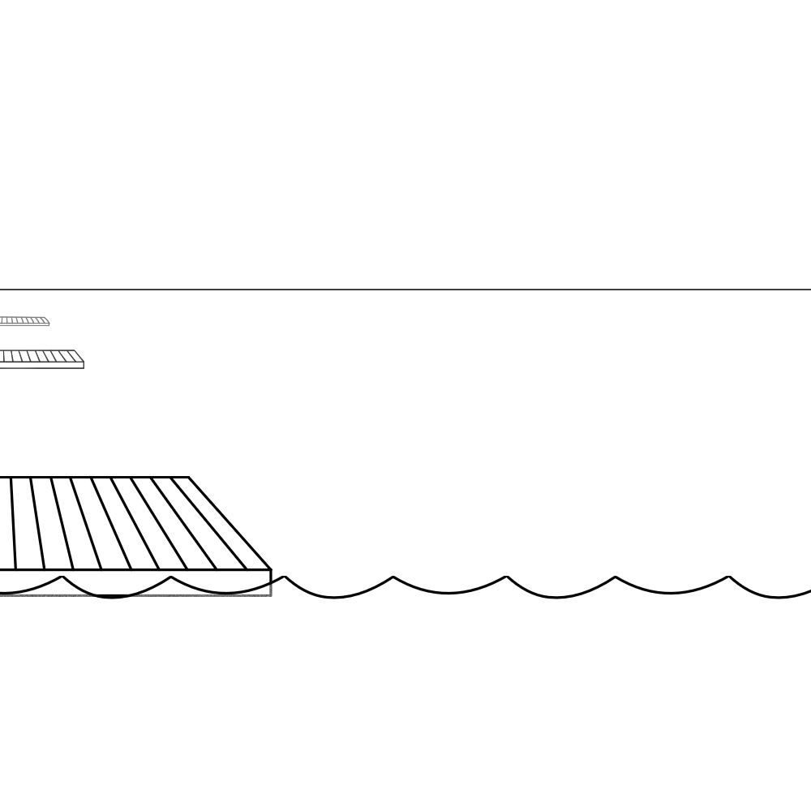

# y_u_no_swim

Simple program that takes in a tcx file and allows you to set a pool length calculating distances to your manually recorded laps.

</img>

It will save a new file with the distances that you can upload to your favorite fitness tracking app.

This is currently a work in progress, but the command line version and a basic gui will work.

Just run activity.py in a python interpreter or gui.py (requires tkinter to be installed) and you will be able to surpass the limitations of your smartwatch.
